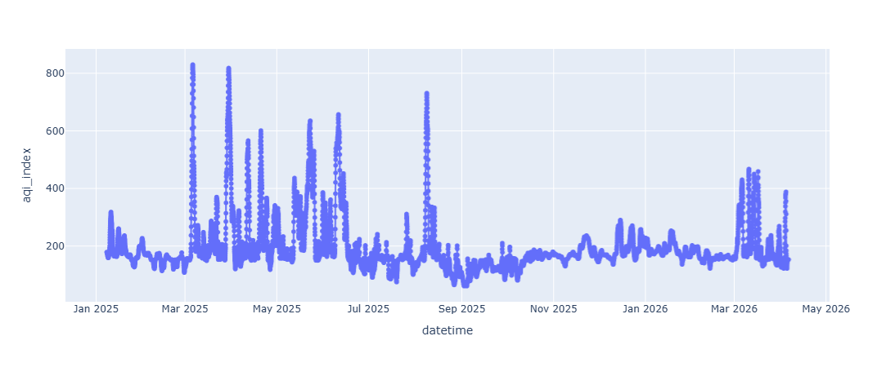
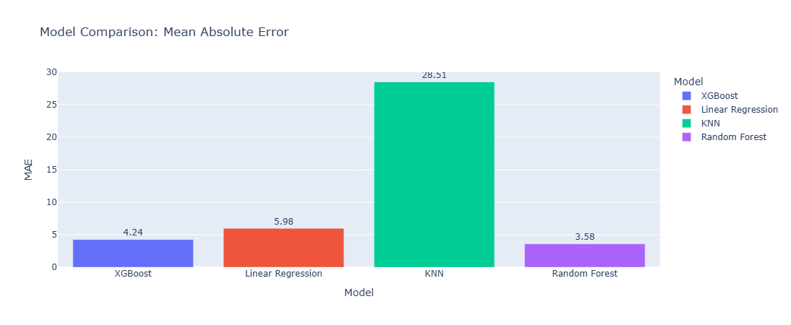
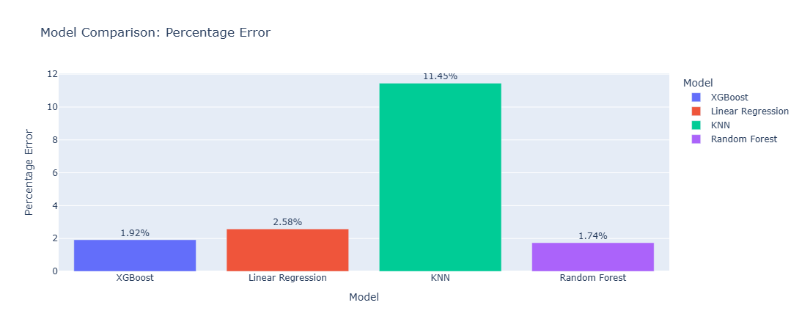
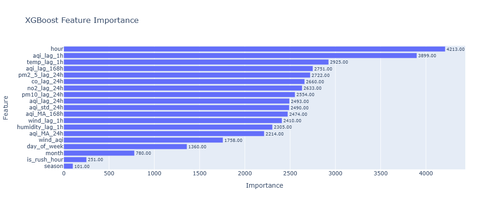
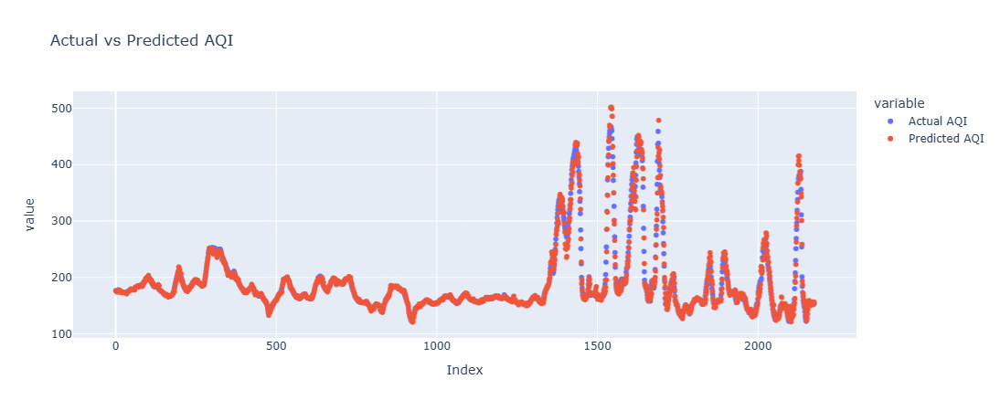

# 🌫️ Delhi AQI — Is It Safe to Go Out ❓

A machine learning project that predicts next hour's Air Quality Index (AQI) for Anand Vihar, Delhi and tells vulnerable groups like **senior citizens, children, and people with respiratory conditions** whether it is safe to go outside.

## 📌 Problem Statement


Delhi's air quality is among the worst in the world and it changes every hour. For senior citizens and people with respiratory conditions, stepping outside during hazardous AQI hours can be genuinely dangerous.\
\
This project builds a regression model that predicts the next hour's AQI using weather conditions, historical AQI patterns, pollutant levels, and temporal features. The prediction is then translated into a simple, actionable safety recommendation:
```
✅ Safe to go out
⚠️  Sensitive groups should take care
🔴 NOT safe for senior citizens — stay indoors
☠️  Hazardous — everyone should stay indoors
```
A live Streamlit app fetches real-time data from Open-Meteo every hour and shows the current safety status for Anand Vihar, Delhi.

## 📊 Dataset
- Source- [Delhi AQI Dataset, Kaggle](https://www.kaggle.com/datasets/sohails07/delhi-weather-and-aqi-dataset-2025) + Data   Fetched from API (Note 1)

- Location- Anand Vihar, Delhi (one of India's most monitored pollution hotspots)

- Shape- 52560 rows X 16 columns

- Hourly Data

Note 1:- I fetched more data later through Open-Meteo API, in order to get realtime predictions after training the model.

Note 2:- Data had other locations too but I excluded it since duplicates were present for the same date-time (Discussed in 'Big Mistakes')
## Raw Features of Dataset

| Feature | Description |
|----------|----------|
|date_ist, time_ist     | Date and Time in IST
| temp_c   | Temperature (°C)   |
|humidity| Relative Humidity(%)
|Pressure_mb| Atmospheric Pressure(mb)
|windspeed_kph| Wind Speed(Km/h)
|aqi_index|Air Quality Index Value
|pm2_5|Particulate Matter < 2.5 micrometers
|pm10|Particulate Matter < 10 micrometers
|co|Carbon Monoxide concentration
|no2|Nitrogen Dioxide concentration

## 👨‍🔬 Feature Engineering

_All features are carefully shifted using shift(1) or further to prevent data leakage - no feature contains information from the current hour being predicted_

1.  #### Lag Features:-
```
aqi_lag_1h   = AQI 1 hour ago
aqi_lag_24h  = AQI 24 hours ago (same hour yesterday)
aqi_lag_168h = AQI 168 hours ago (same hour last week)
```

2.  #### Rolling Features:-
```
aqi_MA_24h   = 24-hour rolling mean  (shifted)
aqi_MA_168h  = 7-day rolling mean    (shifted)
aqi_std_24h  = 24-hour rolling std   (shifted) — captures volatility
```

3. #### Pollutant Lags (24hrs and 168hrs obly):-
```
pm2_5_lag_24h, pm10_lag_24h    # yesterday's pollutant levels
no2_lag_24h,   co_lag_24h
pm2_5_lag_168h, pm10_lag_168h  # last week's pollutant levels
```

Note:- 1-hour pollutant lags were excluded, PM2.5 and PM10 are direct components of the AQI formula, making 1h lags a form of leakage.

4. #### Weather Features:-
```
temp_lag_1h, humidity_lag_1h, wind_lag_1h
wind_x_aqi = wind_lag_1h * aqi_lag_1h   # High windspeed = Pollants travel more area
```

5. #### Time Features:-
```
hour          # captures rush hour pollution spikes
day_of_week   # weekday vs weekend traffic patterns
month         # seasonal variation
season        # winter=0, spring=1, summer=2, autumn=3
is_weekend    # binary flag
is_rush_hour  # 7-9 AM and 5-7 PM flag (critical hours for Anand Vihar)
```
## 🧪 Models Used and Tested

| Model | MAE | MAPE | Model Used|
|-------|-----|-----|------------|
|XGBoost Regressor|4.244|1.92 %|☑️
|Random Forest Regressor|3.584|1.74 %|❌
|Linear Regression|5.981|3.58 %|❌
| KNN Regressor| 28.509|11.45 %|❌

- **Random Forest** was found to collapse **98.7%** of feature importance onto a single feature (aqi_lag_1h), indicating it was not generalising well despite low MAE and MAPE. **_XGBoost_** was chosen as the final model due to its healthier, distributed feature importance.

- While other Models like **Linear Regression** and **KNN** didn't performed well. So it wasn't considered


## 📈 XGBoost Feature Importances

**_Key Insights:-_**

- **aqi_lag_1h** is the strongest signal — AQI changes slowly hour to hour.

- **hour** is the second most important — rush hour pollution spikes are very consistent

- Weather features (temp, humidity, wind) contribute meaningfully — physics-based signals are learnable

## 🛑 Data Leakage Prevention
This project paid careful attention to leakage, a common mistake in time series ML:
```
# Features use shift(1) — only past data, never current hour
df['aqi_MA_24h'] = df['aqi_index'].rolling(24).mean().shift(1)

# Target uses shift(-1) — predict the NEXT hour
df['target_aqi'] = df['aqi_index'].shift(-1)
```

## 📈 Results & Graphs

1. **_AQI Overtime_**



2. **_Model Comparisions_**




3. **_XGBoost Feature Importance_**



4. **_Actual vs Predicted_**



## ❓ How to Run ?
1. **Clone the Repository**
```
git clone https://github.com/yourusername/aqi-prediction.git
cd aqi-prediction
```

2. **Install Dependencies**
```
pip install -r requirements.txt
```

3. **Run the Notebook**
```
jupyter notebook model.ipynb
```

## ✅ Requirnments
```
pandas
numpy
scikit-learn
xgboost
plotly
jupyter
```

## Project Structure

```
aqi-prediction/
│
├── model.ipynb   # Main notebook
├── data/
│   └── delhi-weather-aqi-2025.csv       # Raw dataset
├── requirements.txt
└── README.md
```

## Ⓜ️ Big Mistakes
1. **Data Leakage** : used pm10_lag_1h which is a direct 
   component of AQI formula

2. **fillna(0)**: filled rolling average NaNs with 0 
   instead of dropping them, injecting fake data

3. **Not shifting moving averages**:  MA_7 and MA_30 
   included today's value while predicting today's target


## Ⓜ️ Big Mistakes
1. **Data Leakage** : used pm10_lag_1h which is a direct 
   component of AQI formula

2. **fillna(0)**: filled rolling average NaNs with 0 
   instead of dropping them, injecting fake data

3. **Not shifting moving averages**:  MA_7 and MA_30 
   included today's value while predicting today's target


# 🎯 Key Learning

1. Raw pollutant columns (PM2.5, PM10) are components of AQI, using their 1-hour lags is a form of leakage even though they appear to be separate features.

2. Random Forest is prone to collapsing onto a single dominant feature in time series data; XGBoost handles this better through sequential boosting

3. Time features (hour, season) are extremely powerful for AQI because pollution follows highly consistent daily and seasonal patterns

4. Multi-Location Lag Mixing
Mistake: Created lag features before filtering to a single location.
Why it was wrong: Anand Vihar's lag_1h was pulling from a completely different station's last row.
Fix: Filter to one location first, then compute all lag features.

## Want to run the app ?

[](https://zaidhusain-ml-projects-streamlit-app.streamlit.app)

## 🙋 Author

**Zaid Khan** — ML Engineer\
Feel free to connect or raise issues for suggestions!

